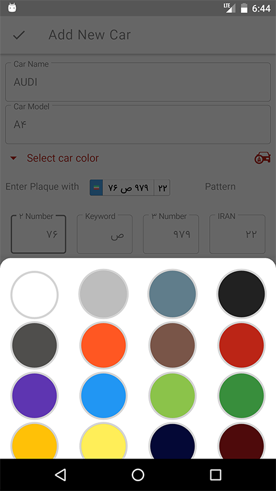
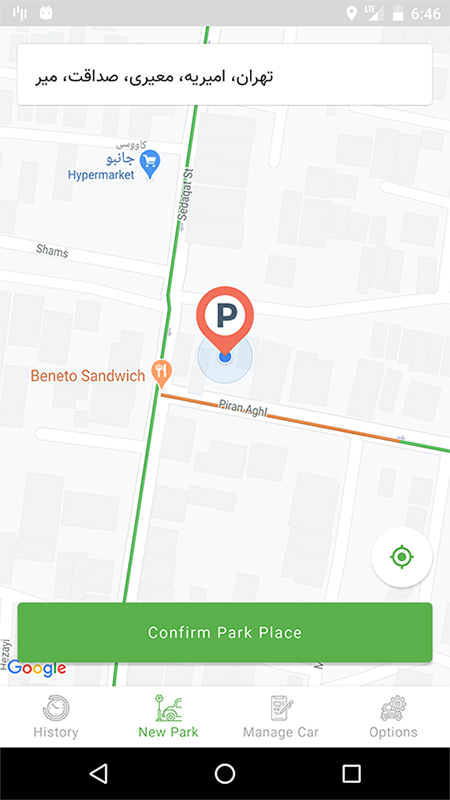
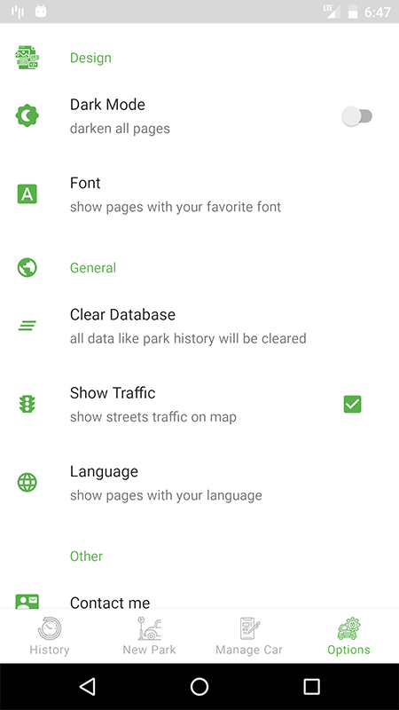

# StopCar
* find your parked car with one touch

open source Android project for learn latest  trends on Android

Add New Car| Mark Park Location | Menu |
--- | --- | --- | 
 |  |  |

# About Project
StopCar is a simple app that detects your location with address on map and save it in database.
you can view the saved location again and start direction to the place.

Some Features:

* add multiple cars
* add car specifications like: name,model,color and number plate
* show traffic
* park history
* addressing
* dark theme
* change font
* change language

# Run Project
* First create a local.properties in root folder
* Get a [GoogleMap](https://cloud.google.com/maps-platform/)  Api Key and add to the properties file with "google_map_api_key" tag
* Get a [Neshan](https://developers.neshan.org/)  Api Key and add to the properties file with "neshan_api_key" tag

Now you can open the project in AndroidStudio and build/Test/Run it.
 
 # Technologies
 - [Model–view–ViewModel architecture](https://www.journaldev.com/20292/android-mvvm-design-pattern)
 - [Kotlin](https://kotlinlang.org/)
 - [AndroidX](https://developer.android.com/jetpack/androidx)
 - [Android Jetpack](https://developer.android.com/jetpack)
 - [Dagger2](https://dagger.dev/users-guide)
- [RxJava](https://github.com/ReactiveX/RxJava)
 - [Retrofit](https://github.com/square/retrofit)
- [OkHttp](https://github.com/square/okhttp)
- [LeakCanary](https://github.com/square/leakcanary)
- [Lottie](https://airbnb.design/lottie/)
- [Google Map Android](https://developers.google.com/maps/documentation/android-sdk/intro)

# TODO
* Edit the car
* Notification Reminder
* Add Spotlight View
* Detect Driving Mode
* Wears Support
* calculate distance between user and car
* Add Shortcuts
* Capture Photo when park
* Add Backup and Restore

# Contributing
Contributions are most welcome to StopCar. You can contribute in various ways such as reporting issues, suggesting features, adding documentation and providing bug fixes.
 
